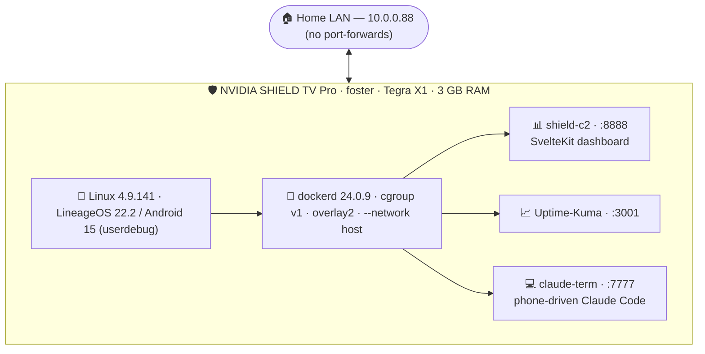
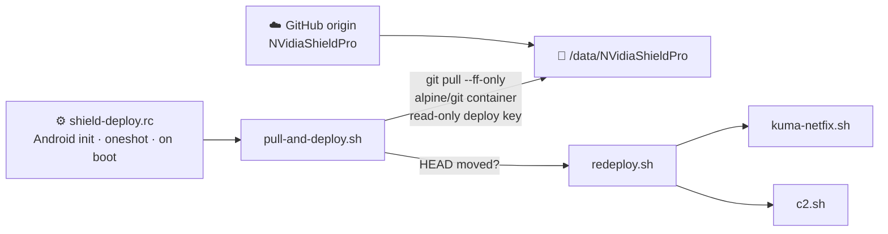

# 🛡️ NVidiaShieldPro

**A 2015 NVIDIA SHIELD TV Pro, rooted and reborn as an always-on Docker home-server + remote dev box.**
LineageOS 22.2 / Android 15 on a **kernel-4.9 Tegra X1** — no reflash, no custom kernel.

 

 

---

> [!NOTE]
> Every hardware and OS figure below is read **directly from the device over network ADB (`10.0.0.88:5555`)** — not copied from a spec sheet. Manufacturer specs that can't be read over ADB are marked **_(spec)_**. Personal identifiers (serial, full MAC, public IPv6) are redacted; the LAN IP `10.0.0.88` is kept on purpose.

## 🖥️ Hardware — verified via ADB @ 10.0.0.88

| | At a glance |
|---|---|
| 🧠 **SoC** | NVIDIA Tegra X1 (T210), Maxwell GM20B |
| ⚡ **CPU** | 4× Cortex-A57 @ **1.734 GHz**, `arm64-v8a` |
| 🎮 **GPU** | NVIDIA Tegra · OpenGL ES 3.2 · driver 495.00 |
| 🧮 **RAM** | 2.87 GiB + ~882 MiB zram swap |
| 💽 **Disk** | 465.8 GiB HDD · `/data` ext4 **447 GB (~444 GB free)** |
| 🌐 **Network** | Gigabit `eth0` @ **10.0.0.88** (Wi-Fi down) |
| 🌡️ **Idle** | CPU 33 °C · GPU 31 °C |

<b>📋 Full hardware detail (identity · CPU · GPU · memory · storage · display · network · thermals)</b>

### Identity
| Field | Value | Source |
|---|---|---|
| Model | `SHIELD Android TV` (NVIDIA) | `ro.product.model` |
| Device / variant | `foster` / `foster_e_hdd` — the **500 GB HDD Pro** | `ro.product.device`, `ro.product.name` |
| SoC | **NVIDIA Tegra X1 (T210)** — `tegraid=21.1.2.0.0` (chip `0x21` = T210) in the kernel cmdline | `/proc/cmdline`, `ro.board.platform=tegra` |
| Bootloader | `32.00.2019.50-t210-c5cc57a8`, **unlocked** (`androidboot.bllock=0`) | `/proc/cmdline` |
| Secure OS | TLK (Trusted Little Kernel), `androidboot.secureos=tlk` | `/proc/cmdline` |

### CPU — `/proc/cpuinfo` + `sysfs`
- **4 cores online** (`present = 0-3`, `online = 0-3`, cmdline `maxcpus=4`), and **every one is a Cortex-A57** (`CPU part 0xd07`, implementer `0x41` = ARM, ARMv8-A `v8l`).
- The device exposes only the 4× A57 cluster; nothing past `cpu3` is presented to the OS and all cores report part `0xd07`. (Marketing calls this "octa-core" — the A53 cluster is not surfaced.)
- **Max clock 1.734 GHz** per core (`cpufreq/cpuinfo_max_freq = 1734000` kHz, read under `adb root`).
- Features: `fp asimd aes pmull sha1 sha2 crc32`. ABI `arm64-v8a` (+ `armeabi-v7a`). 4 KB pages.

### GPU
- **Renderer** (`dumpsys SurfaceFlinger`): **NVIDIA Corporation / NVIDIA Tegra**, **OpenGL ES 3.2**, driver **NVIDIA 495.00**, **EGL 1.5**. Full `GL_NV_*` extension set present.
- Architecture **_(spec)_**: Maxwell **GM20B**, 256 CUDA cores.

### Memory
- **`MemTotal` = 3,009,644 kB (~2.87 GiB)** (`/proc/meminfo`).
- **`SwapTotal` = 902,888 kB (~882 MiB)** — `zram0` compressed-RAM swap.

### Storage
- Physical disk **`sda` ~465.8 GiB (~500 GB)** — the Pro's drive (`foster_e_hdd`), on the SATA controller (`androidboot.boot_devices=…tegra-sata.0…`). GPT, ~32 partitions.
- Key **ext4** mounts (`df -h`, `/proc/mounts`):

  | Mount | Device | Size | Notes |
  |---|---|---|---|
  | `/data` | `sda32` | **447 GB (~444 GB free, 1% used)** | container images + workspaces; `rw,noatime,nobarrier` |
  | `/` | `sda22` | 1.9 GB | system, mounted **ro** |
  | `/vendor` | `sda24` | 758 MB | |
  | `/cache` | `sda23` | 232 MB | |

### Display
- **Physical 3840 × 2160 (4K)**; current render **override 1920 × 1080**; density **320 dpi** (`wm size` / `wm density`).

### Network
- **`eth0` — Gigabit Ethernet, the live link:** MAC `00:04:4b:xx:xx:xx` (NVIDIA OUI; suffix redacted), IPv4 **`10.0.0.88/24`**, plus global and link-local IPv6 (redacted). This is the box's stable address used everywhere below.
- **`wlan0` — present but `DOWN`.** The box runs on wired Ethernet.

### Thermals & load (idle snapshot)
`/sys/class/thermal`: CPU **33 °C**, GPU **31 °C**, PLL 32 °C, board 36 °C, diode 37.75 °C, PMIC 50 °C. Load average around **0.03 / 0.02 / 0.00** at idle.

## 🐧 Operating system

-critical?style=flat-square)

- **LineageOS 22.2** — `22.2-20260608-NIGHTLY-foster`; **Android 15** (SDK **35**), security patch **2026-06-01**.
- Build `lineage_foster-userdebug 15 BP1A.250505.005`, type **`userdebug`**, so `adb root` gives a real root shell on-device (`uid=0`, SELinux `u:r:su:s0`); **no Magisk, no on-device `su`**.
- This is an **unofficial** build. foster's official LineageOS support ended at roughly LOS 18.1 / Android 11, so 22.2 is community/self-built: `ro.build.type=userdebug` + `ro.build.tags=release-keys`, built by `ro.build.user=root` on `ro.build.host=ea7fe48de6dd` (a 12-hex Docker container ID, the signature of a containerized ROM build).
- **Kernel `4.9.141`** (`4.9.141-g9d1bd583388e`, SMP PREEMPT, `aarch64`, **Toybox** userland), built 2026-06-08.
- **Vendor base:** stock NVIDIA **Android 11** blobs (`…/foster:11/RQ1A.210105.003`); Lineage 22.2 (Android 15) runs on top of the Android-11 vendor image.
- **ADB over network is persistent** on `:5555` (`persist.adb.tcp.port=5555`), so the box is reachable at `10.0.0.88:5555` across reboots, hands-off.

> [!WARNING]
> **Do not accept an OTA / update to a stock "user" build.** This is a self-built **userdebug** LineageOS image; a stock update would overwrite it and take `adb root` (and the Docker setup that depends on it) with it. Full flash/rebuild reference: [`docs/01-rooting-and-lineageos.md`](docs/01-rooting-and-lineageos.md).

> [!IMPORTANT]
> The **4.9 kernel is the defining constraint** of this box: it forces Docker onto **cgroup v1**, and its **bridge/veth path is broken** (ARP stays `INCOMPLETE` across `docker0`) — so **every container runs `--network host`**. Details: [`docs/02-docker-on-kernel-4.9.md`](docs/02-docker-on-kernel-4.9.md).

## 🧱 The stack

- **🐳 Docker 24.0.9** (static arm64) — on **cgroup v1** (forced via a private-mount-namespace), **overlay2** on ext4 `/data`, **`--network host`** (the Tegra X1 kernel's bridge/veth path is broken — ARP stays INCOMPLETE across `docker0`). Reboot-persistent via an Android `init` service.

| Service | Image | URL | What |
|---|---|---|---|
| 📊 **shield-c2** | `shield-c2:latest` | [`:8888`](http://10.0.0.88:8888) | Live CPU/RAM/disk/net/thermals + container start/stop/restart/logs |
| 📈 **Uptime-Kuma** | `louislam/uptime-kuma:2.4.0-slim` | [`:3001`](http://10.0.0.88:3001) | Uptime / health monitoring |
| 💻 **claude-term** | `claude-term:latest` | [`:7777`](http://10.0.0.88:7777) | Phone-launched Claude Code sessions in tmux ([spec](docs/SPEC-claude-term.md) · [bringup](docs/claude-term-bringup-notes.md)) · persistent Claude state, collapsible prompts, login-link banner |

## 🚀 Deployment / pulling changes

This repo is the source of truth; the Shield pulls itself and re-runs the changed launchers. The mechanism is a small git-pull step plus an Android `init` service.

- ⚙️ The Android `init` service **`shield-deploy`** (`/system/etc/init/shield-deploy.rc`) runs on boot and on demand. It is a `oneshot` service — it runs the deploy pass and exits, so `init.svc.shield_deploy=stopped` is the correct state after a successful run.
- 📥 It runs `deploy/pull-and-deploy.sh`, which waits for the dockerd socket, then runs `git pull` inside a throwaway `alpine/git` container (`deploy/git-sync.sh`) — git runs in a container because the Toybox userland has no `git` binary. The clone lives at `/data/NVidiaShieldPro`.
- 🔁 When `HEAD` moves, `deploy/redeploy.sh` re-runs the idempotent launchers (each does `docker rm -f` before any port-free assert, so a re-run while a service is up does not false-fail on "port in use"). On an unchanged `HEAD` the run logs "no change" and does nothing.
- 🔑 Auth is a **read-only SSH deploy key** at `/data/.ssh/shield_deploy_ed25519` (mode `600`), alongside `/data/.ssh/known_hosts`.

On-device installs are deterministic: `npm ci` against the committed `package-lock.json`. Details in **[`deploy/README.md`](deploy/README.md)**.

## 🔒 Dependencies & security notes

> [!CAUTION]
> **`shield-c2` and Uptime-Kuma are unauthenticated and bound to the LAN by design.** This is safe **only** because the Shield is not reachable from the internet (no port-forwards). The control surface is bounded by a server-side docker-socket allowlist, not by auth — see the full [**threat model**](docs/THREAT-MODEL.md).

- **`shield-c2` dependency versions** (committed `package.json`): `@sveltejs/adapter-node ^5.5.4`, `@sveltejs/kit ^2.66.0`, `@sveltejs/vite-plugin-svelte ^6.0.0`, `svelte ^5.1.0`, `vite ^6.3.5`.
- **One accepted residual advisory:** `cookie <0.7.0` (GHSA-pxg6-pf52-xh8x, **LOW**) reaches transitively through `@sveltejs/kit` 2.x. It is irreducible without abandoning SvelteKit 2, and unreachable here — `shield-c2` sets no cookies (`grep -r "cookies.set" src/` returns 0 hits), and `npm audit --omit=dev` returns **0** (the pruned runtime tree carries no vulnerable dependency). A known, accepted, non-exploitable residual.
- **Reproducible builds:** `shield-c2/Dockerfile` uses `npm ci` against the committed `package-lock.json`, so the on-device arm64 image is exactly the tracked dependency tree (no `^`-range drift between lockfile and ship).
- **Launchers are re-run-safe:** each `docker-bringup/*.sh` does `docker rm -f` before any port-free assert, so the pull-deploy can re-run them while a service is up without a false "port in use" failure.
- The static Docker binaries are **not committed** (large; `.gitignore`d).

## 🗂️ What's in this repo

| Path | What |
|---|---|
| 📄 [`docs/01-rooting-and-lineageos.md`](docs/01-rooting-and-lineageos.md) | The current rooted / LineageOS 22.2 state and how to reproduce it. |
| 🐳 [`docs/02-docker-on-kernel-4.9.md`](docs/02-docker-on-kernel-4.9.md) | The Docker-on-kernel-4.9 configuration that runs on the box. |
| 🔧 [`docker-bringup/`](docker-bringup/) | The on-device shell scripts: bring-up, the `dockerd` init service, per-service launchers, and the network diagnostics. |
| 📊 [`shield-c2/`](shield-c2/) | Source of the custom SvelteKit status + control dashboard (`:8888`). |
| 📐 [`docs/SPEC-*.md`](docs/) · [`docs/THREAT-MODEL.md`](docs/THREAT-MODEL.md) | Specs for `shield-c2` and the in-design `claude-term`, plus the threat model. |
| 🚀 [`deploy/`](deploy/) | The pull-deploy mechanism (this repo as source of truth; the Shield pulls itself). |
| 🛠️ [`tools/`](tools/) | Host-side tooling (the app-sideload updater). |

Hardware/OS figures read live over ADB from a single device. Your mileage on other foster units will vary.

